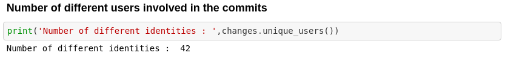
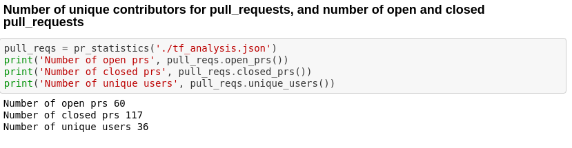

This microtask aims to get a basic overview of about perceval, analysis similar to the following can be done using the data retrieved.
### Commits:

Commits Info

 

Number of unique committers

### Issues:
 

Issues Info

### Pull Requests:
 

PR Info

