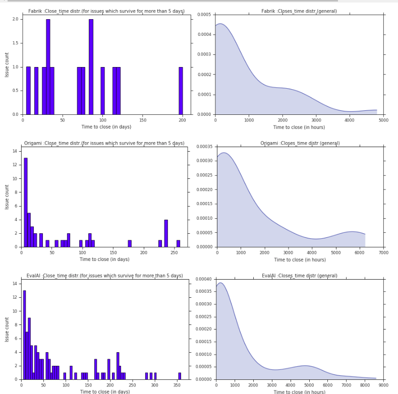

- The charts are present in the notebook, not stored anywhere for now.
***
### Visualiation of Issue Close Time seperately for the three repos

***

### Comparison of Issue Close Time between the three repos

***

 Violin Plot (The width gives the density of issues in that region)

