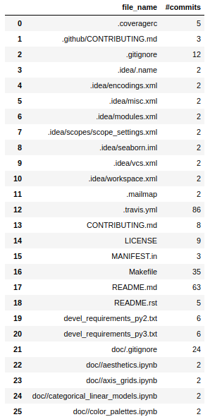
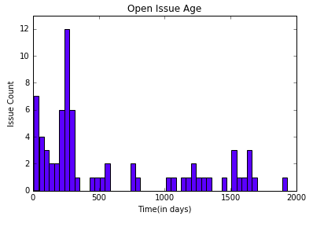
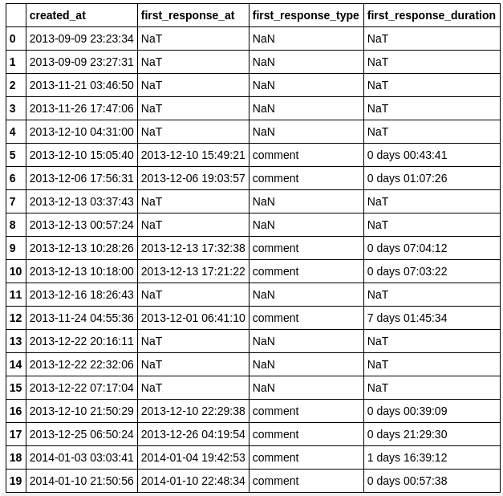

* The json files contain the retrieved data for this microtask from the [mwaskom/seaborn](https://github.com/mwaskom/seaborn) repo.
* I have tried to perform the following analysis :
  - Count of commits modifying each src code file
  - Open Issues Age (all open issues till now considered)
  - First_response duration to a PR (either a review or comment is counted as a reponse)

***
### The results are as follows:

#### Count of commits modifying each file

***

#### Age of open issues

***

#### DataFrame describing the first response to a PR
The fields present in the DataFrame:
- 'created_at' : "When the PR was created"
- 'first_response_type' : "comment"/"review"
- 'first_respone_at' : "Time of first response to the PR"
- 'first_response_duration' : "Time elapsed since the PR was opened to when the first response was made"

**The rows having the value 'Nat' means no response was made to those PR's**, they were directly merged, closed or are still open. 
(We can remove these rows from here since we are particularly interested in the analysis of **PR_first_response**)

